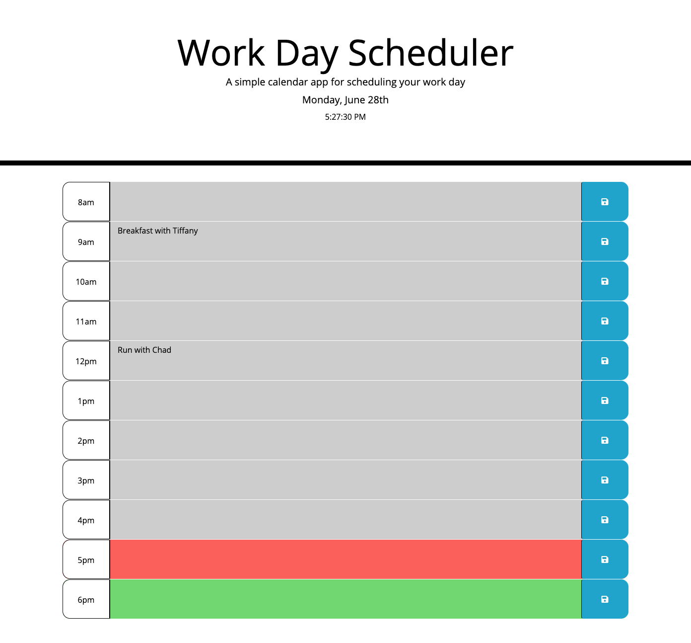

# <Third-Party APIs: Work Day Scheduler>

## The Task

The goal of this task was to create a simple calendar application that allows a user to save events for each hour of the day by modifying starter code. This app will run in the browser and feature dynamically updated HTML and CSS powered by jQuery.

This required the use of the [Moment.js](https://momentjs.com/) library to work with date and time and was implemented to display the current date and time when the calendar is loaded. 

Furthermore, it required the use of jQuery update the clock, add the past, present and future CSS class colours and to save the user inputs to localStorage. 

I found jQuery very difficult to work with at the beginning but after playing with it for a few hours it really simplified/streamlined the process of implementing actions onto the HTML page. 

Lastly, I changed the folder name of my Assets to assets after uploading it to Github and while I thought my commits were being documented they were not updating because of this. 

## Acceptance Criteria

```md
GIVEN I am using a daily planner to create a schedule
WHEN I open the planner
THEN the current day is displayed at the top of the calendar
WHEN I scroll down
THEN I am presented with timeblocks for standard business hours
WHEN I view the timeblocks for that day
THEN each timeblock is color coded to indicate whether it is in the past, present, or future
WHEN I click into a timeblock
THEN I can enter an event
WHEN I click the save button for that timeblock
THEN the text for that event is saved in local storage
WHEN I refresh the page
THEN the saved events persist
```
## Usage 

The following image demonstrates the application appearance:



The following animation demonstrates the application functionality:


## The Deployed Website 

The application can be accessed using the following link: 

[Link to website](https://davidszamek.github.io/daily-planner/index.html "Daily Planner Homepage")
